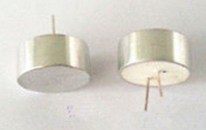
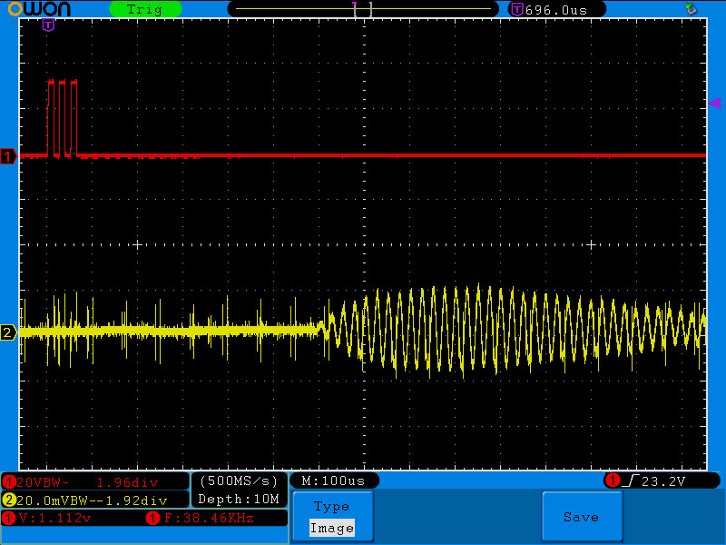

## Ultrasonic Transducer experiments

### experiment #1

Off-the-eBay-shelf 40 KHz, 25 mm x2 transducers:

Terasic DE0-Nano board with Altera Cyclone IV FPGA (EP4CE22F17C6):

:red_circle: *Red line:* (Transmitter) direct 3.3V drvive from FPGA. 3 pulse train: 40KHz

:full_moon: *Yellow line:* (Receiver) 200mm distance. ~600us latency:

Observing LONG Reverberation after the end of the signal: >600us
